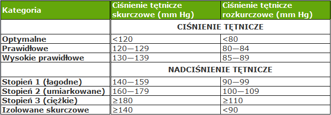
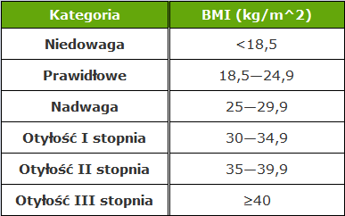

```{=tex}
\begin{titlepage}
\vspace*{1cm}
\begin{center}\small

Politechnika Lubelska \\
Wydział Podstaw Techniki \\

\end{center}
\vspace{3cm}
\noindent\linia
        \begin{center}
            \LARGE \textsc{ Analiza czynników ryzyka zachorowania \\na chorobę niedokrwienną serca}
        \end{center}
        \noindent\linia
                \begin{center}

\textsc{Projekt z zakresu analizy danych}

    \end{center}
            \vspace{1cm}
        
        \begin{flushright}
            \begin{minipage}{5cm}
                \textit{\small Autor:}\\
                \normalsize \textsc{Marcin Woźniak} \par
            \end{minipage}
            \vspace{5cm}
            {\small
                \\ Matematyka}\\
            III rok
            
        \end{flushright}
\end{titlepage}
```
\newpage

\pagenumbering{gobble}

```{r, message = F, warning = F, echo = F}
library(tidyverse)
library(ggstatsplot)
library(flextable)
knitr::opts_chunk$set(echo = F, message = F, warning = F,
 fig.width = 6,
 fig.asp = 0.8,
 out.width = "70%",
 fig.align = 'center')
pdf.options(encoding = 'CP1250')
```

```{r}
framingham <- read.csv("Framingham.csv")
framingham$education <- as.factor(framingham$education)
framingham$male <- as.logical(framingham$male)
framingham$currentSmoker <- as.logical(framingham$currentSmoker)
framingham$BPMeds <- as.logical(framingham$BPMeds)
framingham$prevalentStroke <- as.logical(framingham$prevalentStroke)
framingham$prevalentHyp <- as.logical(framingham$prevalentHyp)
framingham$diabetes <- as.logical(framingham$diabetes)
framingham$TenYearCHD <- as.logical(framingham$TenYearCHD)
```

# Wstęp

W polskiej populacji niezmiennie od wielu lat choroby układu krążenia (ChUK) są główną przyczyną zgonów -- W 2020 roku stanowiły ok. 37% wszystkich przyczyn zgonów. Wśród nich największy odsetek stanowi choroba niedokrwienna serca (ChNS , ang. Coronary Heart Disease -- CHD) -- w 2013 było to 23.0% zgonów z powodu ChUK w populacji ogólnej i 21.6% zgonów z powodu ChUK w populacji 65+. W 2017 roku na ChNS chorowało w Polsce 1.6 mln osób (4.2% populacji).

Choroba niedokrwienna serca to pojęcie obejmujące wszystkie stany niedokrwienia mięśnia sercowego. Klinicznie dzieli się ona na:

• dławicę piersiową stabilną

• ostre zespoły wieńcowe

• dławicę odmienną

• nieme niedokrwienie

Zidentyfikowano wiele czynników zwiększających ryzyko wystąpienia ChNS. Możemy podzielić je na niemodyfikowalne i modyfikowalne. Do tych pierwszych zaliczamy:

• wiek

• płeć

• wywiad rodzinny

Do czynników modyfikowalnych możemy zaliczyć między innymi:

• nadciśnienie tętnicze (NT)

• palenie tytoniu

• nadwagę i otyłość

• cukrzycę

• zaburzenia lipidowe

Celem projektu będzie zbadanie istnienia zależności pomiędzy niektórymi z wyżej wymienionych czynników a ryzykiem wystąpienia choroby niedokrwiennej serca.

# Materiały i metody

Do analizy statystycznej został wykorzystany zbiór danych pochodzący ze strony internetowej kaggle.com, zawierający informacje pochodzące z badania „Framingham Heart Study". Jest to badanie kohortowe prowadzone od 1948 roku na populacji miasteczka Framingham w USA. Należy zaznaczyć, że nie są to wszystkie dane pochodzące z tego badania, a jedynie nieznana ich część -- najpewniej informacje dotyczące jednej z badanych kohort. Dane zawierają `r nrow(framingham)` rekordów, z których dla każdego opisanych jest `r ncol(framingham)` cech.

Przygotowanie danych, analiza statystyczna i wizualizacja zostały wykonane z użyciem języka R i programu RStudio. Wykorzystano testy statystyczne z pakietu `stats`. Jako graniczną wartość p-value ustalono 0.05. Ilorazy szans obliczono z użyciem funkcji `epitools::oddsratio()`.

# Opisanie zmiennych

-   `male` -- płeć (1 -- mężczyzna, 0 -- kobieta), zmienna nominalna

-   `age` -- wiek pacjenta, zmienna ilościowa

-   `education` -- wykształcenie pacjenta, w czterostopniowej skali, zmienna nominalna

-   `currentSmoker` -- czy pacjent obecnie pali (1 -- tak, 0 -- nie), zmienna nominalna

-   `cigsPerDay` -- przeciętna liczba wypalanych dziennie papierosów, zmienna ilościowa

-   `BPMeds` -- czy pacjent przyjmuje/przyjmował leki na nadciśnienie (1 -- tak, 0 -- nie), zmienna nominalna

-   `prevalentStroke` -- czy pacjent przebył udar mózgu (1 -- tak, 0 -- nie), zmienna nominalna

-   `prevalentHyp` -- czy pacjent ma rozpoznane nadciśnienie tętnicze (1 -- tak, 0 -- nie), zmienna nominalna

-   `diabetes` -- czy pacjent ma rozpoznaną cukrzycę (1 -- tak, 0 -- nie), zmienna nominalna

-   `totChol` -- stężenie cholesterolu całkowitego we krwi, zmienna ilościowa

-   `sysBP` -- przeciętna wartość skurczowego ciśnienia tętniczego krwi, zmienna ilościowa

-   `diaBP` -- przeciętna wartość rozkurczowego ciśnienia tętniczego krwi, zmienna ilościowa

-   `BMI` -- Body Mass Index, zmienna ilościowa

-   `heartRate` -- przeciętna wartość częstości akcji serca, zmienna ilościowa

-   `glucose` -- stężenie glukozy we krwi -- najprawdopodobniej jest to stężenie glukozy na czczo, zmienna ilościowa

-   `TenYearCHD` -- czy w ciągu 10 lat obserwacji u pacjenta rozpoznano ChNS (1 -- tak, 0 - nie), zmienna nominalna

Zmienna `TenYearCHD` zostanie użyta do badania różnic w ryzyku wystąpienia ChNS.

# Ustalenie hipotez badawczych

Hipotezy badawcze zostały ustalone na podstawie dostępnej literatury. Ich celem będzie zweryfikowanie, czy poznane czynniki ryzyka są istotne dla badanej przeze mnie populacji:

1.  Wraz z wiekiem rośnie ryzyko wystąpienia ChNS.

2.  U mężczyzn występuje większe ryzyko ChNS niż u kobiet.

3.  U osób z rozpoznanym nadciśnieniem istnieje większe ryzyko ChNS niż u osób bez nadciśnienia.

4.  Wraz ze wzrostem skurczowego ciśnienia krwi rośnie ryzyko wystąpienia ChNS.

5.  Wraz ze wzrostem rozkurczowego ciśnienia krwi rośnie ryzyko wystąpienia ChNS.

6.  U osób z rozpoznaną cukrzycą istnieje większe ryzyko ChNS niż u osób bez cukrzycy.

7.  Wraz ze wzrostem BMI rośnie ryzyko wystąpienia ChNS.

8.  Wraz ze wzrostem stężenia cholesterolu całkowitego rośnie ryzyko wystąpienia ChNS.

9.  Osoby palące papierosy mają większe ryzyko wystąpienia ChNS.

10. Wraz ze wzrostem liczby dziennie wypalanych papierosów rośnie ryzyko wystąpienia ChNS.

# Przygotowanie danych

Przed przystąpieniem do analizy statystycznej należy wstępnie przygotować dostępne dane.

```{r}
brakujace_dane <- as.data.frame(colSums(is.na(framingham)))
colnames(brakujace_dane) <- "liczba brakujących danych"
knitr::kable(brakujace_dane, caption = "Braki danych w analizowanym zbiorze")
```

```{r}
brak_inf <- sum(is.na(framingham))

proc_brak <- round(sum(is.na(framingham))/(nrow(framingham)*ncol(framingham)) *100, 2)

brak_rek <- nrow(framingham[!complete.cases(framingham),])

proc_brak_rek <- round(nrow(framingham[!complete.cases(framingham),])/(nrow(framingham))*100, 1)

```

W analizowanym zbiorze brakuje łącznie `r brak_inf` informacji, co stanowi ok. `r proc_brak`% wszystkich danych. Rekordów, w których brakuje danych jest `r brak_rek`, co stanowi `r proc_brak_rek`% wszystkich rekordów. Najliczniejsze braki występują dla cech `glucose` oraz `education`.

## Cecha `education`

```{r}
framingham |> 
  mutate(edu_na = is.na(education)) -> tmp_df

tmp_df <- select(tmp_df, age, male, edu_na)
```

```{r}
p_shapiro_age_eduNA <- signif(shapiro.test(tmp_df[tmp_df$edu_na == TRUE, "age"])$p.value, 3)

p_shapiro_age_edu_notNA <- signif(shapiro.test(tmp_df[tmp_df$edu_na == FALSE, "age"])$p.value, 3)
```

Ponieważ dane najpewniej nie pochodzą z ankiety, możemy przypuszczać, że parametry medyczne zostały uzupełnione przez badającego, natomiast informacja o poziomie edukacji pacjenta może być jedynie jego deklaracją - możemy sprawdzić, czy brak tej informacji nie jest zależny od płci i wieku pacjentów. Ponieważ rozkład wieku w zależności tego, czy została podana informacja o edukacji nie jest rozkładem normalnym (dla braku danych: p = `r p_shapiro_age_eduNA`, dla pozostałych: p = `r p_shapiro_age_edu_notNA`, test Shapiro-Wilka), dlatego do porównania użyjemy testu Manna-Whitneya. Dla zbadania różnic w braku informacji o edukacji w zależności od płci użyjemy testu chi\^2.

```{r}
p_age_edu <- round(wilcox.test(tmp_df$age~tmp_df$edu_na, exact = F)$p.value, 4)
```

Test Manna-Whitneya wskazuje na brak istotnych różnic w rozkładzie wieku w zależności od podania informacji o edukacji (p = `r p_age_edu`).

```{r}
p_male_edu <- round(chisq.test(table(tmp_df$male, tmp_df$edu_na))$p.value, 4)
```

Test chi\^2 sugeruje, że nie ma podstaw do odrzucenia hipotezy o niezależności płci i braku informacji o edukacji (p = `r p_male_edu`).

Cechę `education` uzupełnimy modą z użyciem funkcji `DMwR2::centralImputation()`.

```{r}
imp_df <- DMwR2::centralImputation(framingham)
df <- framingham
df$education <- imp_df$education
#as.data.frame(colSums(is.na(df)))
```

## Cechy `currentSmoker` i `cigsPerDay`

Cechy te są w oczywisty sposób ze sobą związane. Należy sprawdzić czy nie ma w tych kolumnach sprzecznych informacji tj. czy nie ma rekordów, dla których `currentSmoker = True` i `cigsPerDay = 0`, lub `currentSmoker = F` i `cigsPerDay != 0`:

```{r, echo = T}
nrow(filter(df, currentSmoker == TRUE & cigsPerDay == 0))
nrow(filter(df, currentSmoker == FALSE & cigsPerDay != 0))
```

Z powyższych obliczeń wynika, że w zbiorze nie występują zaprzeczające sobie informacje.

Następnie możemy ocenić braki danych w kolumnie `cigsPerDay` z uwzględnieniem kolumny `currentSmoker`:

```{r, echo = T}
nrow(filter(df, currentSmoker == FALSE & is.na(cigsPerDay))) 
nrow(filter(df, currentSmoker == TRUE & is.na(cigsPerDay)))
```

W przypadku wszystkich 29 rekordów, w których brakuje zmiennej `cigsPerDay` wszystkie zmienne `currentSmoker` są równe 1. Możemy te dane uzupełnić medianą rekordów, dla których liczba dziennie wypalanych papierosów jest większa od 0 (dla wszystkich rekordów łącznie mediana wynosi 0 - uzupełnienie taką wartością doprowadziłoby do sprzeczności).

```{r}
df$cigsPerDay[is.na(df$cigsPerDay)] <- median(framingham$cigsPerDay[framingham$cigsPerDay != 0], na.rm = T)
```

```{r}
#as.data.frame(colSums(is.na(df)))
```

## Pozostałe braki danych

Pozostałe dane zostaną uzupełnione medianą (zmienne ilościowe) lub modą (zmienne jakościowe) odpowiednich kolumn.

```{r}
df <- DMwR2::centralImputation(df)
```

```{r}
braki <- as.data.frame(colSums(is.na(df)))
colnames(braki) <- "liczba brakujących danych"
knitr::kable(braki, caption = "Braki danych po edycji")
rm(braki)

```

W badanym zbiorze nie mamy już brakujących informacji. Po tym wstępnym przetworzeniu danych możemy przejść do analizy statystycznej.

# Podstawowe informacje o badanej grupie

W badanej grupie obecnych było `r nrow(df)` pacjentów. Kobiety stanowiły `r round(nrow(df[df$male == F,])/nrow(df)*100, 1)`% pacjentów a mężczyźni `r 100-round(nrow(df[df$male == F,])/nrow(df)*100, 1)`%. Średnia wieku pacjentów wynosiła `r round(mean(df$age), 1)` +/- `r round(sd(df$age), 1)` lat (przedział wiekowy pacjentów: `r min(df$age)` -- `r max(df$age)` lat).

```{r}
#Szczegółowe informacje z podziałem na płeć przedstawia tabela poniżej.

# library(rtables)
# 
# s_summary <- function(x) {
#   if (is.numeric(x)) {
#     in_rows(
#       "Mean (SD)" = rcell(c(mean(x, na.rm = TRUE), sd(x, na.rm = TRUE)), format = "xx.x (xx.x)"),
#       "Min - Max" = rcell(range(x, na.rm = TRUE), format = "xx.x - xx.x")
#     )
#   } else if (is.factor(x)) {
#     
#     vs <- as.list(table(x))
#     do.call(in_rows, lapply(vs, rcell, format = "xx"))
#     
#   } else (
#     stop("type not supported")
#   )
# }  
# 
# s_proportion <- function(x, .N_col) {
#    in_rows(.list = lapply(as.list(table(x)), function(xi) rcell(xi * c(1, 1/.N_col), format = "xx (xx.x%)")))
# }
# 
# percentage <- function(x, .N_col, .N_total){
#   in_rows(
#     " " = rcell(.N_col/.N_total, format = "xx.x%")
#   )
#}
```

```{r}

# 
# l <- basic_table() %>%
#   split_cols_by("male") %>%
#   add_colcounts() %>%
#   analyze("male", afun = percentage, format = "xx.x", var_labels = "") %>%
#   analyze("age", afun = s_summary, format = "xx.x", var_labels = "Wiek") %>%
#   analyze(c("sysBP"), afun = s_summary, format = "xx.x", var_labels = "skurczowe") %>%
#   analyze(c("diaBP"), afun = s_summary, format = "xx.x", var_labels = "rozkurczowe")
# 
# tbl <- build_table(l, st_op)
# as_html(tbl, width = "80%")
```

```{r}
# 
# st_op <- df
# 
# st_op$male <- ifelse(st_op$male == T, "M", "K")
# 
# st_op$male <- as.factor(st_op$male)
# 
# st_op |> 
#   group_by(male) |> 
#   summarize(m_age = round(mean(age), 1),
#             sd_age = round(sd(age), 1),
#             min_age = min(age),
#             max_age = max(age),
#             m_sysBP = round(mean(sysBP), 1),
#             sd_sysBP = round(sd(sysBP), 1),
#             min_sysBP = min(sysBP),
#             max_sysBP = max(sysBP),
#             m_diaBP = round(mean(diaBP), 1),
#             sd_diaBP = round(sd(diaBP), 1),
#             min_diaBP = min(diaBP),
#             max_diaBP = max(diaBP)) |> 
#   unite(mean_sd_age, m_age, sd_age, sep = " +/- ") |> 
#   unite(range_age, min_age, max_age, sep= " -- ") |> 
#   unite(mean_sd_sysBP, m_sysBP, sd_sysBP, sep = " +/- ") |>
#   unite(range_sysBP, min_sysBP, max_sysBP, sep= " -- ") |> 
#   unite(mean_sd_diaBP, m_diaBP, sd_diaBP, sep = " +/- ") |>
#   unite(range_diaBP, min_diaBP, max_diaBP, sep= " -- ") -> 
#   st_op
# 
# flextable(st_op)
```

U `r round(nrow(df[df$TenYearCHD == T,])/nrow(df)*100, 1)`% pacjentów w ciągu 10 lat rozpoznano chorobę niedokrwienną serca - zachorowało `r round(nrow(df[df$male == T & df$TenYearCHD == T,])/nrow(df[df$male == T,])*100, 1)`% wszystkich mężczyzn i `r round(nrow(df[df$male == F & df$TenYearCHD == T,])/nrow(df[df$male == F,])*100, 1)`% wszystkich kobiet.

# Weryfikacja hipotez

## Wpływ wieku na ryzyko wystąpienia ChNS

```{r}
p_age_CHD <- signif(wilcox.test(df$age~df$TenYearCHD, exact = F)$p.value, 3)
```

Z powodu braku normalności rozkładu wieku dla obu wartości `TenYearCHD` (W teście Shapiro-Wilka w obu przypadkach p \< 0.05) użyjemy testu Manna-Whitneya. Test sugeruje, że istnieją istotne różnice w rozkładzie wieku w zależności od wystąpienia w ciągu 10 lat ChNS (p = `r p_age_CHD`). Wiek ma istotny wpływ na wystąpienie ChNS.

Różnice obrazuje poniższy wykres:

```{r}
ggbetweenstats(df, x = TenYearCHD, y = age, type = "nonparapetric", pairwise.comparisons = F, plot.type = "box", xlab = "Wystąpienie ChNS w ciągu 10 lat", ylab = "Wiek [lata]",
               title = "Rozkład wieku a 10-letnie rozpoznanie ChNS") +
  scale_x_discrete(labels = c("Nie", "Tak")) +
  scale_colour_manual(values = c("#64a70b","#da291c"))+ 
  theme(plot.title = element_text(hjust = 0.5))
```

Ryzyko wystąpienia ChNS możemy również przedstawić, dzieląc badanych na kilka przedziałów wiekowych.

```{r}
df$ageCategory <- as.factor(ifelse(df$age < 40, "1. < 40",
                                           ifelse(df$age < 50, "2. 40 - 50",
                                                  ifelse(df$age < 55, "3. 50 - 55", ifelse(df$age < 60, "4. 55 - 60", ifelse(df$age < 65, "5. 60 - 65", "6. > 65"))))))
```

```{r}

ggbarstats(df, y = ageCategory, 
           x = TenYearCHD, 
           proportion.test = F,
           xlab = "Przedział wiekowy", 
           ylab = "Odsetek zdrowych/chorych",
           legend.title = "ChNS w ciągu 10 lat", 
           legend.labs =c('Tak', 'Nie'),
           bf.message = F,
           title = "Odstetek 10-letnich rozpoznań ChNS dla różnych grup wiekowych") +
  scale_fill_manual(values = c("#da291c", "#64a70b"), labels = c("Tak", "Nie")) +
  scale_x_discrete(labels = c("< 40",
                     "40 - 50",
                     "50 - 55",
                     "55 - 60",
                     "60 - 65",
                     "\u2265 65"))+ 
  theme(plot.title = element_text(hjust = 0.5), legend.position="top")
```

Dla tak utworzonych grup test chi\^2 sugeruje, że należy odrzucić hipotezę o niezależności wieku od ryzyka wystąpienia ChNS.

## Płeć a ryzyko wystąpienia ChNS

```{r}
p_male_chd_propTest <- signif(prop.test(c(length(df$male[df$male== T & df$TenYearCHD == 1]), length(df$male[df$male== F & df$TenYearCHD == 1])), 
          c(length(df$male[df$male== T]), length(df$male[df$male== F])), alternative = "greater")$p.value, 3)

p_male_chd_chisqTest <- signif(chisq.test(df$male, df$TenYearCHD)$p.value, 3)
```

W badanym przypadku możemy użyć podwójnego testu istotności dla frakcji lub testu chi\^2. Test chi\^2 wskazuje, że należy odrzucić hipotezę o niezależności płci i ryzyka wystąpienia ChNS. Ryzyko wystąpienia ChNS istotnie zależy od płci (p = `r p_male_chd_chisqTest`). Również podwójny test istotności dla frakcji wskazuje, że należy odrzucić hipotezę o równości frakcji w populacji kobiet i mężczyzn. Odsetek wystąpienia ChNS u mężczyzn jest istotnie większy niż u kobiet (p = `r p_male_chd_propTest`). Różnice obrazuje poniższy wykres.

```{r}
ggbarstats(df, y = male, 
           x = TenYearCHD, 
           proportion.test = F, 
           xlab = "Płeć", 
           legend.title = "ChNS w ciągu 10 lat",
           ylab = "Odsetek zdrowych/chorych",
           bf.message = F,
           title = "Odstetek 10-letnich rozpoznań ChNS z podziałem na płeć")  +
  scale_x_discrete(labels = c("Kobiety", "Mężczyźni")) +
  scale_fill_manual(values = c("#da291c", "#64a70b"), labels = c("Tak", "Nie"))+ 
  theme(plot.title = element_text(hjust = 0.5), legend.position="top")
```

## Nadciśnienie a ryzyko ChNS

Ponownie możemy użyć podwójnego testu istotności i testu chi\^2.

```{r}
p_hyp_chd_propTest <- signif(prop.test(c(length(df$prevalentHyp[df$prevalentHyp== T & df$TenYearCHD == 1]), length(df$prevalentHyp[df$prevalentHyp== F & df$TenYearCHD == 1])), 
          c(length(df$prevalentHyp[df$prevalentHyp== T]), length(df$prevalentHyp[df$prevalentHyp== F])), alternative = "greater")$p.value, 3)

p_hyp_chd_chisqTest <- signif(chisq.test(df$male, df$TenYearCHD)$p.value, 3)
```

Test chi\^2 wskazuje, że należy odrzucić hipotezę o niezależności obecności nadciśnienia i ryzyka wystąpienia ChNS. Ryzyko wystąpienia ChNS istotnie zależy od obecności nadciśnienia (p = `r p_hyp_chd_chisqTest`). Również podwójny test istotności dla frakcji wskazuje, że należy odrzucić hipotezę o równości frakcji w populacjach osób z nadciśnieniem i bez. Odsetek wystąpienia ChNS u osób z nadciśnieniem jest istotnie większy niż u osób bez nadciśnienia (p = `r p_hyp_chd_propTest`). Różnice obrazuje poniższy wykres.

```{r}
ggbarstats(df, y = prevalentHyp, 
           x = TenYearCHD, 
           proportion.test = F, 
           xlab = "Nadciśnienie tętnicze", 
           legend.title = "ChNS w ciągu 10 lat",
           ylab = "Odsetek zdrowych/chorych",
           bf.message = F,
           title = "Odstetek 10-letnich rozpoznań ChNS \n z podziałem na pacjentów z NT i bez NT")  +
  scale_x_discrete(labels = c("Nie", "Tak"))  +
    scale_fill_manual(values = c("#da291c", "#64a70b"), labels = c("Tak", "Nie"))+ 
  theme(plot.title = element_text(hjust = 0.5), legend.position="top")
```

## Wpływ ciśnienia tętniczego krwi na ryzyko wystąpienia ChNS

### Wpływ skurczowego ciśnienia tętniczego krwi na ryzyko wystąpienia ChNS

```{r}
# df |>
#   group_by(TenYearCHD) |>
#   summarise(p_shapiro_sysBP = shapiro.test(sysBP)$p.value,
#             p_shapiro_diaBP = shapiro.test(diaBP)$p.value)
```

```{r}
p_sysBP_chd <- signif(wilcox.test(df$sysBP~df$TenYearCHD, exact = F)$p.value, 3)
```

Ponieważ rozkłady cechy `sysBP` w zależności od zmiennej `TenYearCHD` nie są normalne (dla obu wartości zmiennej w teście Shapiro-Wilka p \< 0.05), zostanie użyty test Manna-Whitneya. Wykonany test wskazuje, że istnieją istotne różnice w rozkładzie skurczowego ciśnienia tętniczego w zależności od wystąpienia w ciągu 10 lat ChNS (p = `r p_sysBP_chd`). Skurczowe ciśnienie tętnicze krwi ma istotny wpływ na wystąpienie ChNS.

```{r}
ggbetweenstats(df, x = TenYearCHD, y = sysBP, type = "nonparapetric", pairwise.comparisons = F, plot.type = "box", xlab = "Wystąpienie ChNS w ciągu 10 lat", ylab = "Skurczowe ciśnienie tętnicze [mmHg]",
               title = "Rozkład wartości skurczowego ciśnienia tętniczego \n a 10-letnie rozpoznanie ChNS") +
  scale_colour_manual(values = c("#64a70b","#da291c")) +
  scale_x_discrete(labels = c("Nie", "Tak"))+ 
  theme(plot.title = element_text(hjust = 0.5))
```

### Wpływ rozkurczowego ciśnienia tętniczego krwi na ryzyko wystąpienia ChNS

```{r}
p_diaBP_chd <- signif(wilcox.test(df$diaBP~df$TenYearCHD, exact = F)$p.value, 3)
```

Zachodzi podobna sytuacja jak w przypadku ciśnienia rozkurczowego (brak normalności rozkładów, p \< 0.05). W związku z tym ponownie użyjemy testu Manna-Whitneya. Test sugeruje, że istnieją istotne różnice w rozkładzie rozkurczowego ciśnienia tętniczego w zależności od wystąpienia w ciągu 10 lat ChNS (p = `r p_diaBP_chd`). Rozkurczowe ciśnienie tętnicze krwi ma istotny wpływ na wystąpienie ChNS.

```{r}
ggbetweenstats(df, x = TenYearCHD, y = diaBP, type = "nonparapetric", pairwise.comparisons = F, plot.type = "box", xlab = "Wystąpienie ChNS w ciągu 10 lat", ylab = "Rozkurczowe ciśnienie tętnicze [mmHg]",
               title = "Rozkład wartości rozkurczowego ciśnienia tętniczego \n a 10-letnie rozpoznanie ChNS") +
  scale_colour_manual(values = c("#64a70b","#da291c")) +
  scale_x_discrete(labels = c("Nie", "Tak"))+ 
  theme(plot.title = element_text(hjust = 0.5))
```

### Zestawienie wyników

Dla lepszego zobrazowania różnic ryzyku zachorowania na ChNS możemy przedstawić dane o zachorowaniu w zależności od stopnia nasilenia nadciśnienia tętniczego. W tym celu podzielimy badaną grupę według następującego, obowiązującego obecnie podziału:

{fig-align="center"}

```{r}

df$BPcategory <- as.factor(ifelse(df$sysBP >= 180 | df$diaBP >= 110, "6. nadcisnienie 3 st", 
                                          ifelse(df$sysBP >= 160 | df$diaBP >= 100, "5. nadcisnienie 2 st",
                                                 ifelse(df$sysBP >= 140 | df$diaBP >= 90, "4. nadcisnienie 1 st",
                                                        ifelse(df$sysBP >= 130 | df$diaBP >= 85, "3. prawidlowe wysokie",
                                                               ifelse(df$sysBP >= 120 | df$diaBP >= 80, "2. prawidlowe", "1. optymalne"))))))


```

```{r}
ggbarstats(df, y = BPcategory, x = TenYearCHD, proportion.test = F, legend.title = "ChNS w ciągu 10 lat", xlab = "Kategoria ciśnienia tętniczego", ylab = "Odsetek zdrowych/chorych", bf.message = F,
           title = "Odstetek 10-letnich rozpoznań ChNS \n dla różnych kategorii ciśnienia tętniczego") +
  scale_fill_manual(values = c("#da291c", "#64a70b"), labels = c("Tak", "Nie")) +
  scale_x_discrete(labels = c("Optymalne",
                              "Prawidłowe",
                              "Prawidłowe \n wysokie",
                              "NT \n łagodne",
                              "NT \n umiarkowane",
                              "NT \n ciężkie"))+ 
  theme(plot.title = element_text(hjust = 0.5), legend.position="top")
```

W przypadku tak ustalonych grup test chi\^2 również sugeruje, że ryzyko zachorowania na ChNS istotnie zależy od kategorii ciśnienia tęniczego.

## Cukrzyca a ryzyko ChNS

W badanym przypadku ponownie możemy użyć podwójnego testu istotności dla frakcji lub testu chi\^2.

```{r}
p_diabetes_chd_propTest <- signif(prop.test(c(length(df$diabetes[df$diabetes== T & df$TenYearCHD == 1]), length(df$diabetes[df$diabetes== F & df$TenYearCHD == 1])), 
          c(length(df$diabetes[df$diabetes== T]), length(df$diabetes[df$diabetes== F])), alternative = "greater")$p.value, 3)

p_diabetes_chd_chisqTest <- signif(chisq.test(df$diabetes, df$TenYearCHD)$p.value, 3)
```

Test chi\^2 wskazuje, że należy odrzucić hipotezę o niezależności obecności cukrzycy i ryzyka wystąpienia ChNS. Ryzyko wystąpienia ChNS istotnie zależy od obecności cukrzycy (p = `r p_diabetes_chd_chisqTest`). Również podwójny test istotności dla frakcji wskazuje, że należy odrzucić hipotezę o równości frakcji w populacji cukrzyków i osób bez cukrzycy. Odsetek wystąpienia ChNS u cukrzyków jest istotnie większy niż u osób bez cukrzycy (p = `r p_diabetes_chd_propTest`). Różnice obrazuje poniższy wykres.

```{r}
ggbarstats(df, y = diabetes, x = TenYearCHD, proportion.test = F, xlab = "Cukrzyca", legend.title = "ChNS w ciągu 10 lat",
              ylab = "Odsetek zdrowych/chorych", bf.message = F,
           title = "Odstetek 10-letnich rozpoznań ChNS \n z podziałem na pacjentów z cukrzycą i bez")  +
  scale_x_discrete(labels = c("Nie", "Tak")) +
    scale_fill_manual(values = c("#da291c", "#64a70b"), labels = c("Tak", "Nie"))+ 
  theme(plot.title = element_text(hjust = 0.5), legend.position="top")
```

## Wpływ BMI na ryzyko ChNS

```{r}
# df |>
#   group_by(TenYearCHD) |>
#   summarise(p_shapiro_BMI = shapiro.test(BMI)$p.value)
```

```{r}
p_bmi_chd <- signif(wilcox.test(df$BMI~df$TenYearCHD, exact = F)$p.value, 3)
```

Rozkład BMI nie jest rozkładem normalnym (test Shapiro-Wilka: p \< 0.05). W związku z tym ponownie użyjemy testu Manna-Whitneya. Test sugeruje, że istnieją istotne różnice w rozkładzie BMI w zależności od wystąpienia w ciągu 10 lat ChNS (p = `r p_bmi_chd`). BMI ma istotny wpływ na wystąpienie ChNS.

```{r}
ggbetweenstats(df, x = TenYearCHD, y = BMI, type = "nonparapetric", pairwise.comparisons = F, plot.type = "box", xlab = "Wystąpienie ChNS w ciągu 10 lat", ylab = "BMI",
               title = "Rozkład wartości BMI a 10-letnie rozpoznanie ChNS") +
  scale_x_discrete(labels = c("Nie", "Tak")) +
  scale_colour_manual(values = c("#64a70b","#da291c"))+ 
  theme(plot.title = element_text(hjust = 0.5))
```

Dla lepszego zobrazowania różnic podzielimy badaną grupę według obecnie obowiązujących kategorii:

{fig-align="center"}

```{r}
df$BMIcategory <- as.factor(ifelse(df$BMI < 18.5, "0. niedowaga",
                                           ifelse(df$BMI < 25, "1. norma",
                                    ifelse(df$BMI < 30, "2. nadwaga",
                                           ifelse(df$BMI < 35, "3. otylosc 1 st",
                                                  ifelse(df$BMI < 40, "4. otylosc 2 st", "5. otylosc 3 st"))))))

```

```{r}
ggbarstats(df, y = BMIcategory, x = TenYearCHD, proportion.test = F, legend.title = "ChNS w ciągu 10 lat", xlab = "Kategoria BMI", ylab = "Odsetek zdrowych/chorych", bf.message = F,
           title = "Odstetek 10-letnich rozpoznań ChNS dla różnych kategorii BMI") +
  scale_fill_manual(values = c("#da291c", "#64a70b"), labels = c("Tak", "Nie")) +
  scale_x_discrete(labels = c("Niedowaga",
                              "Prawidłowe",
                              "Nadwaga",
                              "Otyłość \n I stopnia",
                              "Otyłość \n II stopnia",
                              "Otyłość \n III stopnia"))+ 
  theme(plot.title = element_text(hjust = 0.5), legend.position="top")
```

## Stężenie cholesterolu całkowitego a ryzyko ChNS

```{r}
# df |>
#   group_by(TenYearCHD) |>
#   summarise(p_shapiro_totChol = shapiro.test(totChol)$p.value)
```

```{r}
p_totChol_chd <- signif(wilcox.test(df$totChol~df$TenYearCHD, exact = F)$p.value, 3)
```

Rozkład całkowitego stężenia cholesterolu nie jest rozkładem normalnym (w obu grupach w teście Shapiro-Wilka p \< 0.05). W związku z tym tu również użyjemy testu Manna-Whitneya. Test sugeruje, że istnieją istotne różnice w rozkładzie całkowitego stężenia cholesterolu we krwi w zależności od wystąpienia w ciągu 10 lat ChNS (p = `r p_totChol_chd`). Całkowite stężenie cholesterolu we krwi ma istotny wpływ na wystąpienie ChNS.

```{r}
ggbetweenstats(df, x = TenYearCHD, y = totChol, type = "nonparapetric", pairwise.comparisons = F, plot.type = "box", xlab = "Wystąpienie ChNS w ciągu 10 lat", ylab = "Cholesterol całkowity [mg/dl]",
               ,
               title = "Rozkład stężeń choleserolu całkowitego a 10-letnie rozpoznanie ChNS") +
  scale_colour_manual(values = c("#64a70b","#da291c")) +
  scale_x_discrete(labels = c("Nie", "Tak"))+ 
  theme(plot.title = element_text(hjust = 0.5))
```

Dane można również przedstawić w podziale na dwie grupy: o wartości stężenia cholesterolu całkowitego poniżej i powyżej górnej granicy normy (200 mg/dl).

```{r}
df$CholBig <- ifelse(df$totChol > 200, T, F) 
ggbarstats(df, y = CholBig, x = TenYearCHD, proportion.test = F, legend.title = "ChNS w ciągu 10 lat", xlab = "Stężenie cholesterolu całkowitego [mg/dl]", ylab = "Odsetek zdrowych/chorych", bf.message = F,
           title = "Odsetek 10-letnich rozpoznań ChNS \n z podziałem górną granicą normy stężenia cholesterolu całkowitego") +
  scale_fill_manual(values = c("#da291c", "#64a70b"), labels = c("Tak", "Nie")) +
  scale_x_discrete(labels = c("\u2264 200",
                              "\u003E 200"))+
  theme(plot.title = element_text(hjust = 0.5), legend.position="top")
```

## Palenie tytoniu a ryzyko ChNS

Tutaj również możemy użyć podwójnego testu istotności dla frakcji lub testu chi\^2.

```{r}
p_smoke_chd_propTest <- signif(prop.test(c(length(df$currentSmoker[df$currentSmoker== T & df$TenYearCHD == 1]), length(df$currentSmoker[df$currentSmoker== F & df$TenYearCHD == 1])), 
          c(length(df$currentSmoker[df$currentSmoker== T]), length(df$currentSmoker[df$currentSmoker== F])), alternative = "greater")$p.value, 3)

p_smoke_chd_chisqTest <- signif(chisq.test(df$currentSmoker, df$TenYearCHD)$p.value, 3)
```

Test chi\^2 wskazuje, że nie ma podstaw do odrzucenia hipotezy o niezależności palenia tytoniu od ryzyka wystąpienia ChNS (p = `r p_smoke_chd_chisqTest`). Również podwójny test istotności dla frakcji wskazuje, że nie należy odrzucać hipotezy o równości odsetka ChNS u palaczy i osób niepalących (p = `r p_smoke_chd_propTest`). Wyniki możemy zobrazować na wykresie.

```{r}
ggbarstats(df, y = currentSmoker, x = TenYearCHD, proportion.test = F, xlab = "Palenie tytoniu", legend.title = "ChNS w ciągu 10 lat",
              ylab = "Odsetek zdrowych/chorych", bf.message = F,
           ,
           title = "Odstetek 10-letnich rozpoznań ChNS dla palących i niepalących")  +
  scale_x_discrete(labels = c("Nie", "Tak")) +
    scale_fill_manual(values = c("#da291c", "#64a70b"), labels = c("Tak", "Nie"))+ 
  theme(plot.title = element_text(hjust = 0.5), legend.position="top")
```

## Liczba wypalanych papierosów a ryzyko ChNS

W badanym przypadku uwzględniono jedynie osoby deklarujące się jako palące.

```{r}
p_cigsPerDay_chdT <- signif(shapiro.test(df$cigsPerDay[df$TenYearCHD == T & df$currentSmoker ==T])$p.value, 3)
p_cigsPerDay_chdF <- signif(shapiro.test(df$cigsPerDay[df$TenYearCHD == F & df$currentSmoker ==T])$p.value, 3)
```

```{r}
p_cigsPerDay_CHD <- signif(wilcox.test(df$cigsPerDay~df$TenYearCHD, exact = F)$p.value, 3)
```

W celu zbadania omawianej zalezności użyjemy testu Manna-Whitney'a - rozkłady cechy `cigsPerDay` względem cechy `TenYearCHD` nie są rozkładami normalnymi (w obu grupach w teście Shapiro-Wilka p \< 0.05). Test wskazuje, że należy odrzucić hipotezę o braku różnic w rozkładzie ilości dziennie wypalanych papierosów w grupach w których wystąpiła i nie wystąpiła ChNS (p = `r p_cigsPerDay_CHD`). Różnice w rozkładach obrazuje poniższy wykres.

```{r}
df |> 
filter(currentSmoker == T) |>
ggbetweenstats(x = TenYearCHD, y = cigsPerDay, type = "nonparapetric", pairwise.comparisons = F, plot.type = "box",
               xlab = "Wystąpienie ChNS w ciągu 10 lat", ylab = "Liczba wypalanych dziennie papierosów",
               title = "Rozkład ilości dzienie wypalanych papierosów \n a 10-letnie rozpoznanie ChNS") +
  scale_x_discrete(labels = c('Nie', 'Tak')) +
  scale_colour_manual(values = c("#64a70b","#da291c"))+ 
  theme(plot.title = element_text(hjust = 0.5))
```

# Wnioski

```{r}
# round(epitools::oddsratio(table(df$male, df$TenYearCHD))$measure[2,], 2)
# round(epitools::oddsratio(table(df$prevalentHyp, df$TenYearCHD))$measure[2,], 2)
# round(epitools::oddsratio(table(df$diabetes, df$TenYearCHD))$measure[2,], 2)
```

```{r}
# df$Obesity <- ifelse(df$BMI >=30, T, F)
# round(epitools::oddsratio(table(df$Obesity, df$TenYearCHD))$measure[2,], 2)
```

```{r}
# round(epitools::oddsratio(table(df$CholBig, df$TenYearCHD))$measure[2,], 2)
```

W badaniu wykazano, że ryzyko jej wystąpienia istotnie zwiększają:

-   Wiek

-   Płeć męska -- OR = 1.63 (CI$_{95\%}$: 1.38 -- 1.94)

-   Nadciśnienie tętnicze -- OR = 2.68 (CI$_{95\%}$: 2.25 -- 3.17)

-   Cukrzyca -- OR = 3.39 (CI$_{95\%}$: 2.25 -- 5.03)

-   Otyłość - dla danych podzielonych na dwie grupy wartością BMI równą 30: OR = 1.42 (CI$_{95\%}$: 1.12 -- 1.78)

-   Wysokie stężenie cholesterolu - wyniki są istotne statystycznie, jednak w badanej grupie bezwzględne różnice w rozkładach stężenia cholesterolu są niewielkie, wynik jest niejednoznaczny. Różnice są lepiej widoczne dla danych podzielonych górną granicą normy dla stężenia cholesterolu całkowitego (200 mg/dl) - OR = 1.67 (CI$_{95\%}$: 1.33 -- 2.12). Warto zauważyć, że jedynie niecała 1/4 (885 osób) badanej grupy ma stężenie cholesterolu będące poniżej tej granicy.

Nie wykazano istotnych różnic w ryzyku wystąpienia ChNS między osobami palącymi i niepalącymi. Z kolei liczba dziennie wypalanych papierosów przez palaczy miała istotny wpływ na ryzyko wystąpienia ChNS. Z tego powodu nie można wykluczyć negatywnego wpływu palenia tytoniu na wystąpienie ChNS.

Należy zaznaczyć, że wyniki nie powinny być uogólniane na populację polską - badania pochodzą z USA, a literatura wyróżnia populacje o różnym stopniu ryzyka, badana populacja niekoniecznie musi mieć tego samego stopnia ryzyka, co populacja polska. Wspomnieć należy również o jakości użytych danych -- nie są między innymi znane doładne informacje o zmiennych `sysBP` i `diaBP` -- czy są to przeciętne wartości ciśnień, czy też wartości ciśnień z pojedynczych pomiarów w gabinecie lekarskim. Podobnie z cechami `heartRate` i `glucose` (nie analizowanymi w tym badaniu).

Po przeanalizowaniu i wizualizacji powyższych danych można dojść do wniosku, że ocena istotności statystycznej jest przede wszystkim działaniem pomocniczym, a nie decyzyjnym. Wiele zależy również od sposobu przedstawienia danych -- wpływ badanych czynników był lepiej widoczny dla danych pogrupowanych przedstawionych w formie wykresów słupkowych niż dla danych niezagregowanych w formie wykresów ramka-wąsy.

# Bibliografia

1.   <https://www.kaggle.com/datasets/aasheesh200/framingham-heart-study-dataset>

2.  „Umieralność w 2020 roku. Zgony według przyczyn -- dane wstępne" GUS, 2021, <https://stat.gov.pl/obszary-tematyczne/ludnosc/statystyka-przyczyn-zgonow/umieralnosc-i-zgony-wedlug-przyczyn-w-2020-roku,10,1.html>

3.  „Zachorowalność i umieralność na choroby układu krążenia a sytuacja demograficzna polski" Redakcja naukowa: Zbigniew Strzelecki, Janusz Szymborski, Rozdział 5, <https://bip.stat.gov.pl/files/gfx/bip/pl/zamowieniapubliczne/426/248/1/81_gp_rrl_2015_monografia_kardiologiczna.pdf>

4.  „NFZ o zdrowiu Choroba niedokrwienna serca" , Warszawa, kwiecień 2020, Centrala Narodowego Funduszu Zdrowia, Departament Analiz i Innowacji

5.  „Kardiologia" pod redakcją Tadeusza Mandeckiego, Warszawa, 2005

6.  „Eksploracja danych", Dariusz Majerek, Katedra Matematyki Stosowanej, Wydział Podstaw Techniki, Politechnika Lubelska 2020-03-11, <https://dax44.github.io/datamining/>

7.  „Nadciśnienie tętnicze", <https://www.mp.pl/interna/chapter/B16.II.2.20>

8.   <https://www.mp.pl/nadwaga-i-otylosc/wytyczne/246952,-nadwaga-i-otylosc-u-doroslych>

\tableofcontents
